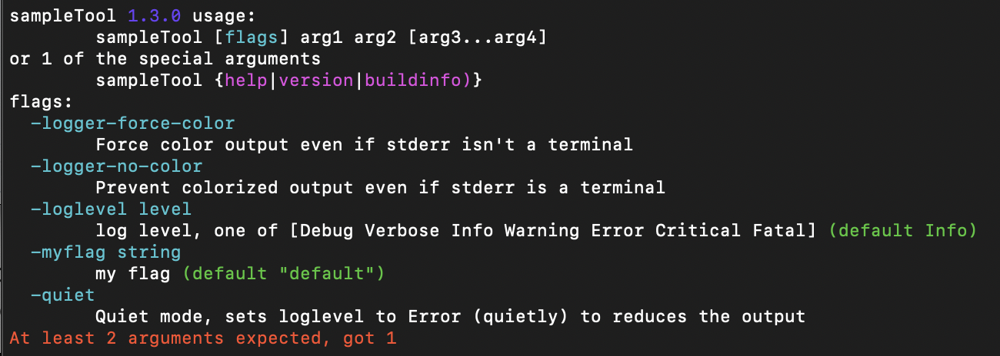
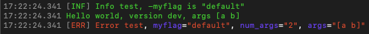

[](https://pkg.go.dev/fortio.org/cli)
[](https://goreportcard.com/report/fortio.org/cli)
[](https://github.com/fortio/cli/releases/)

# cli
Reduce boiler plate needed on each new Golang main functions (Command Line Interface) for both tools and servers (use [fortio.org/scli ServerMain()](https://github.com/fortio/scli#scli) for server)

It abstracts the repetitive parts of a `main()` command line tool, flag parsing, usage, etc...

You can see real use example in a tool like [multicurl](https://github.com/fortio/multicurl) or a server like [proxy](https://github.com/fortio/proxy).

It also supports (sub)commands style (where there is a word/command before the flags and remaining arguments, [fortio](https://github.com/fortio/fortio) uses that mode).

## Tool Example
Client/Tool example (no dynamic flag url or config) [sampleTool](sampleTool/main.go)

Code as simple as
```golang
import (
	"flag"
	"os"

	"fortio.org/cli"
	"fortio.org/log"
)

func main() {
	myFlag := flag.String("myflag", "default", "my flag")
	cli.MinArgs = 2
	cli.MaxArgs = 4
	cli.Main() // Will have either called cli.ExitFunction or everything is valid
	// Next line output won't show when passed -quiet
	log.Infof("Info test, -myflag is %q", *myFlag)
	// This always shows
	log.Printf("Hello world, version %s, args %v", cli.ShortVersion, flag.Args())
	// This shows and is colorized and structured, unless loglevel is set to critical.
	log.S(log.Error, "Error test",
		log.Str("myflag", *myFlag),
		log.Attr("num_args", len(flag.Args())),
		log.Attr("args", flag.Args()))
}
```

```bash
$ sampleTool a
sampleTool 1.2.0 usage:
	sampleTool [flags] arg1 arg2 [arg3...arg4]
or 1 of the special arguments
	sampleTool {help|version|buildinfo}
flags:
  -logger-force-color
    	Force color output even if stderr isn't a terminal
  -logger-no-color
    	Prevent colorized output even if stderr is a terminal
  -loglevel level
    	log level, one of [Debug Verbose Info Warning Error Critical Fatal] (default Info)
  -myflag string
    	my flag (default "default")
  -quiet
    	Quiet mode, sets loglevel to Error (quietly) to reduces the output
At least 2 arguments expected, got 1
```

Since v1.3, the above is colorized on a terminal and looks like this:



or normal case:



Old style, no colors:
```bash
$ sampleTool -logger-no-color a b
17:20:41 [I] Info test, -myflag is "default"
17:20:41 Hello world, version dev, args [a b]
17:20:41 [E] Error test, myflag="default", num_args="2", args="[a b]"
```


## Additional builtins

### buildinfo

e.g

```bash
% go install github.com/fortio/multicurl@latest
go: downloading github.com/fortio/multicurl v1.10.1
% multicurl buildinfo
1.10.1 h1:h9yM3XplwG7JWtVaSS0eJPiDmCJfnxvj3w+yoAMWMo4= go1.19.6 arm64 darwin
go	go1.19.6
path	github.com/fortio/multicurl
mod	github.com/fortio/multicurl	v1.10.1	h1:h9yM3XplwG7JWtVaSS0eJPiDmCJfnxvj3w+yoAMWMo4=
dep	fortio.org/cli	v0.6.1	h1:V9L6ly4oz4fJjeQ5745FulIMsFAwFZvLPSUN+cKUrKk=
dep	fortio.org/log	v1.2.2	h1:vs42JjNwiqbMbacittZjJE9+oi72Za6aekML9gKmILg=
dep	fortio.org/version	v1.0.2	h1:8NwxdX58aoeKx7T5xAPO0xlUu1Hpk42nRz5s6e6eKZ0=
build	-compiler=gc
build	CGO_ENABLED=1
build	CGO_CFLAGS=
build	CGO_CPPFLAGS=
build	CGO_CXXFLAGS=
build	CGO_LDFLAGS=
build	GOARCH=arm64
build	GOOS=darwin
```

### help
```bash
% multicurl help
Fortio multicurl 1.10.1 usage:
	multicurl [flags] url
or 1 of the special arguments
	multicurl {help|version|buildinfo}
flags:
[...]
  -logger-force-color
    	Force color output even if stderr isn't a terminal
  -logger-no-color
    	Prevent colorized output even if stderr is a terminal
  -loglevel level
    	log level, one of [Debug Verbose Info Warning Error Critical Fatal] (default Info)
  -quiet
    	Quiet mode, sets loglevel to Error (quietly) to reduces the output
```

### version
Short 'numeric' version (v skipped, useful for docker image tags etc)
```bash
 % multicurl version
1.10.1
```

### https/tls in FROM scratch docker images

You should always try to use `FROM scratch` Docker images when possible,
it's one of the strength of go.

Using this `fortio.org/cli` as a base makes it work for outcalls to internet valid TLS certs (e.g. https).
It does this by defaulting to the bundle provided by `golang.org/x/crypto/x509roots/fallback` automatically.

See https://github.com/fortio/multicurl for a good example.

If you do not want this behavior, build using `-tags no_tls_fallback`.
